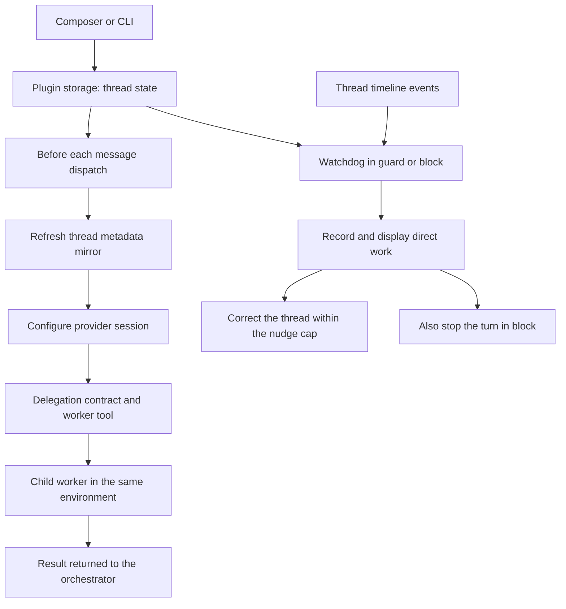

<div align="center">


# Orchestrator Mode

### Keep the plan here. Send the work to worker threads.

Make your BB thread read, plan, ask, delegate and report.<br>
Give each unit of work to a worker, with a watchdog for direct work.


[Features](#features) · [Install](#install) · [How it works](#how-it-works) · [CLI](#cli) · [Settings](#settings) · [Development](#development)

<br>


<table>
<tr>
<td width="50%"><br><sub>The watchdog caught the thread running a command itself, recorded it and corrected the agent.</sub></td>
<td width="50%"><br><sub>The new-thread default, and the <code>+</code> menu row that toggles either.</sub></td>
</tr>
</table>

</div>

> [!NOTE]
> These are real BB renders of a throwaway demo project (a small Node to-do
> CLI). The thread, its worker threads and the recorded violation are real. The
> Playbooks and Recap panels, which belong to other plugins, were hidden so the
> subject reads clearly. See [screenshot notes](docs/screenshots/README.md).

## The problem

You ask a thread to coordinate a task, but it starts doing the work itself.
The planning, implementation and review accumulate in one transcript, even
when parts of the task could run independently.

It can also start out delegating correctly, then drift during a long-running
conversation. It begins editing files, running commands or fixing a worker's
output itself, despite being asked to stay in the orchestrator role.

Orchestrator Mode gives that thread a delegation contract and a worker tool.
In `guard` and `block`, the watchdog checks new timeline work as the conversation
continues and can correct or stop detected direct work. You keep the plan and
final report in the parent, and can open each worker to inspect its work.

| You need | You get |
| --- | --- |
| A thread that coordinates | Instructions to read, plan, ask, delegate and report |
| Separate units of work | Worker threads in the same environment |
| A long-running thread that drifts into direct work | Ongoing timeline checks in `guard` and `block` |
| Visibility when the parent does direct work | A violation record, corrective messages and an optional stop |

## Features

<table>
<tr>
<td width="50%" valign="top">

### 🎛️ A composer switch

Toggle the current thread from the composer or its `+` menu. The status strip
shows the enforcement level and recent direct work; the draft gains a left-edge
accent while the mode is on.

</td>
<td width="50%" valign="top">

### 🧩 Worker threads

The `orchestrator_delegate` tool creates a child thread from a self-contained
brief and can wait for its result. Workers use the parent's environment and
appear in the sidebar unless you request a hidden worker.
Existing sessions without that tool can use `bb orchestrator-mode delegate`.

</td>
</tr>
<tr>
<td valign="top">

### 👁️ Three enforcement levels

Choose instructions alone, a watchdog that records and corrects, or a watchdog
that also stops the turn. The watchdog keeps checking new work as the
conversation continues. Read-only shell exploration is allowed by default.

</td>
<td valign="top">

### 🌱 A default for new threads

Use the root composer to set how new threads start. Only qualifying root
threads created while the default is on receive it; existing threads, child
workers and side chats are left alone.

</td>
</tr>
</table>

## Install

From a local checkout:

```sh
cd /path/to/bb-plugin-orchestrator-mode
npm install
bb plugin build
bb plugin install path:$PWD --yes
```

Open a thread and use **Orchestrator mode** in the composer to enable it.

**Requirements**

- bb **0.44+**, with Plugin SDK **0.5.29+**.
- Node.js and npm to install dependencies and build from source.

## Where to find it

| Where | What |
| --- | --- |
| **Thread composer** | The delegation icon toggles that thread; use **More plugin actions** if the host groups buttons. |
| **Composer `+` menu → Orchestrator mode** | The same toggle, including compact layouts. |
| **Strip above the input** | Enforcement level, recent violations and a **Turn off** button. |
| **Root new-thread composer** | Set whether qualifying new threads start as orchestrators. |
| **Settings → Installed plugins → Orchestrator Mode** | Set enforcement, read-only command handling and the nudge cap. |

## How it works



- **Per-thread state.** The plugin stores the switch in its own KV store and
  refreshes a metadata mirror before dispatch. Session configuration reads that
  mirror synchronously.
- **Delegation.** The worker receives your complete brief, rather than the
  parent's conversation. Independent units can be delegated in parallel.
- **Classification.** The watchdog treats file changes, image generation,
  mutating commands and mutating tool names as work. Reads, searches, plans,
  questions and delegation
  remain available; command leniency is configurable.
- **Session timing.** Running turns receive mode changes as steering messages.
  Session configuration applies when the provider session is next constructed;
  resuming can retain its original tools, so CLI delegation remains available.
  The watchdog grants grace turns during the transition.

The [design notes](docs/DESIGN.md) cover classification, retained state and
session timing in more detail.

## Enforcement limits

- **Detection follows the action.** BB exposes no pre-tool-call veto. `block`
  stops a turn after detection, so a fast write can complete before the stop.
- **Grace turns are intentional.** Enabling an idle thread skips its next turn
  for watchdog judgement. Enabling mid-turn skips the active turn and the next
  one. Earlier timeline work is not judged retroactively.
- **This is a coordination aid.** The instructions and classifier are not a
  security boundary or a guarantee that every action will be caught.
- **Workers share your environment.** Delegation uses ordinary worker threads;
  it does not isolate their files or remove their provider costs.

## CLI

```sh
bb orchestrator-mode status
bb orchestrator-mode on --enforcement guard
bb orchestrator-mode violations --json
bb orchestrator-mode off
```

<details>
<summary><b>All commands</b></summary>

| Command | Does |
| --- | --- |
| `status [--thread <id>] [--json]` | Show mode, enforcement, violations, nudges and delegations. |
| `delegate --task <brief> [--title <title>] [--no-wait] [--timeout <seconds>] [--hidden] [--thread <id>] [--json]` | Run the same delegation action when the native tool is unavailable. |
| `on [--thread <id>] [--enforcement instruct\|guard\|block] [--json]` | Enable the thread, with an optional enforcement override. |
| `off [--thread <id>] [--json]` | Disable the thread and clear its enforcement override. |
| `violations [--thread <id>] [--clear] [--json]` | List violations, or clear them and reset correction counters. |
| `default [on\|off] [--json]` | Show or set the default for new threads. |

`--thread` (alias `-t`) defaults to the thread running the command. In an
ordinary terminal, provide a thread ID for thread commands.

</details>

**Agent tool:**
`orchestrator_delegate({ task, title?, waitForResult?, timeoutSeconds?, hidden? })`.
The brief is required and limited to 20,000 characters; the title is limited to
200. Waiting defaults to `true`, with a 900-second timeout (range 10–3,600).
`hidden` defaults to `false`. A timeout returns the worker's status and leaves it
running. The bundled [skill](skills/orchestrator-mode/SKILL.md) explains the mode,
delegation and CLI; enabled sessions receive the contract directly.

## Settings

`bb plugin config orchestrator-mode`, or **Settings → Installed plugins →
Orchestrator Mode**.

<details>
<summary><b>All settings</b></summary>

| Setting | Default | Effect |
| --- | --- | --- |
| `defaultForNewThreads` | `false` | Enable qualifying root threads created while the default is on, at a user-initiated dispatch. |
| `enforcement` | `guard` | `instruct`: contract only. `guard`: record and correct. `block`: also stop. A thread override takes precedence. |
| `allowReadCommands` | `true` | Treat recognised read-only shell commands as exploration; when off, all commands count as work. |
| `maxNudges` | `3` | Corrective messages per enablement; non-negative numbers are rounded down. `0` disables nudges. Recording and `block` stops continue after the cap. |

Re-enabling an already enabled thread preserves its nudge count. Disabling it
or clearing violations resets the correction counters.

</details>

<details>
<summary><b>Turning it off</b></summary>

Use the strip's **Turn off** button or `bb orchestrator-mode off` for one thread.
Use `bb orchestrator-mode default off` to stop enabling future threads.

```sh
bb plugin disable orchestrator-mode
bb plugin enable orchestrator-mode
```

`bb plugin remove orchestrator-mode` uninstalls the plugin.

</details>

## Development

```sh
npm install
npm test
npm run typecheck
bb plugin build
bb plugin install path:$PWD --yes
bb plugin dev
```

```text
server.ts   settings, storage, dispatch hook, watchdog, delegation, RPC and CLI
shared.ts   pure policy, command classification and contract text
app.tsx     composer toggle, status strip, draft effect and menu fallback
assets/     canonical delegation icon used by BB
skills/     bundled agent skill
docs/       README logo, screenshots and design notes
```

Tests exercise the pure policy, backend behaviour through the SDK's fake plugin
host, and composer surfaces through React render tests. They cover state
mirroring, default eligibility, grace turns, read-only commands, delegation,
enforcement, RPC and CLI behaviour.

`PLUGIN_OVERVIEW.md` is the store listing. Keep it in step with this README,
the bundled skill and `bb.description` in `package.json`. Keep generated `dist/`
out of Git. There are no CI workflows in this repository.

See [screenshot notes](docs/screenshots/README.md) when refreshing the captures.

## Licence

[MIT](LICENSE)
