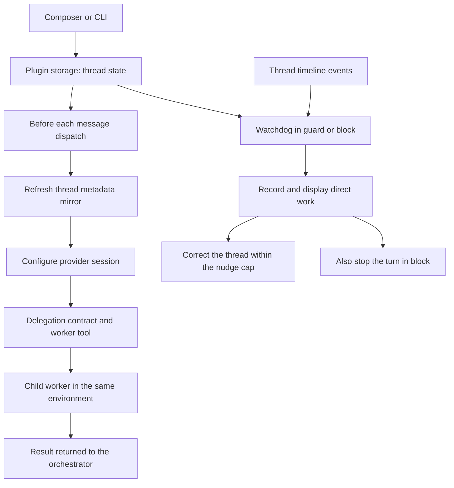

<div align="center">


# Orchestrator Mode

### Keep the plan here. Send the work to worker threads.

Make your BB thread read, plan, ask, delegate and report.<br>
Give each unit of work to a worker, with a watchdog for direct work.


[Features](#features) · [Install](#install) · [How it works](#how-it-works) · [CLI](#cli) · [Settings](#settings) · [Development](#development)

<br>


<table>
<tr>
<td width="50%"><br><sub>The watchdog caught the thread running a command itself, recorded it and corrected the agent.</sub></td>
<td width="50%"><br><sub>The new-thread default, and the <code>+</code> menu row that toggles either.</sub></td>
</tr>
</table>

</div>

> [!NOTE]
> These are real BB renders of a throwaway demo project (a small Node to-do
> CLI). The thread, its worker threads and the recorded violation are real. The
> Playbooks and Recap panels, which belong to other plugins, were hidden so the
> subject reads clearly. See [screenshot notes](docs/screenshots/README.md).

## The problem

You ask a thread to coordinate a task, but it starts doing the work itself.
The planning, implementation and review accumulate in one transcript, even
when parts of the task could run independently.

It can also start out delegating correctly, then drift during a long-running
conversation. It begins editing files, running commands or fixing a worker's
output itself, despite being asked to stay in the orchestrator role.

Orchestrator Mode gives that thread a delegation contract and a worker tool.
In `guard` and `block`, the watchdog checks new timeline work as the conversation
continues and can correct or stop detected direct work. You keep the plan and
final report in the parent, and can open each worker to inspect its work.

| You need | You get |
| --- | --- |
| A thread that coordinates | Instructions to read, plan, ask, delegate and report |
| Separate units of work | Worker threads in the same environment |
| A long-running thread that drifts into direct work | Ongoing timeline checks in `guard` and `block` |
| Visibility when the parent does direct work | A violation record, corrective messages and an optional stop |

## Features

<table>
<tr>
<td width="50%" valign="top">

### 🎛️ A composer switch

Toggle the current thread from the composer or its `+` menu. The status strip
shows the enforcement level and recent direct work; the draft gains a left-edge
accent while the mode is on.

</td>
<td width="50%" valign="top">

### 🧩 Worker threads

The `orchestrator_delegate` tool creates a child thread from a self-contained
brief and can wait for its result. Workers use the parent's environment and
appear in the sidebar unless you request a hidden worker.

You choose their provider and model with BB's own picker in the plugin's
settings, or per delegation in the tool call, and the orchestrator has to record
a verdict for every worker it used. See [Worker
execution](#worker-execution) and [Reviewing worker
output](#reviewing-worker-output).

</td>
</tr>
<tr>
<td valign="top">

### 👁️ Three enforcement levels

Choose instructions alone, a watchdog that records and corrects, or a watchdog
that also stops the turn. The watchdog keeps checking new work as the
conversation continues. Read-only shell exploration is allowed by default.

</td>
<td valign="top">

### 🌱 A default for new threads

Use the root composer to set how new threads start. Only qualifying root
threads created while the default is on receive it; existing threads, child
workers and side chats are left alone.

</td>
</tr>
</table>

## Install

From a local checkout:

```sh
cd /path/to/bb-plugin-orchestrator-mode
npm install
bb plugin build
bb plugin install path:$PWD --yes
```

Open a thread and use **Orchestrator mode** in the composer to enable it.

**Requirements**

- bb **0.44+**, with Plugin SDK **0.5.29+**.
- Node.js and npm to install dependencies and build from source.

## Where to find it

| Where | What |
| --- | --- |
| **Thread composer** | The delegation icon toggles that thread; use **More plugin actions** if the host groups buttons. |
| **Composer `+` menu → Orchestrator mode** | The same toggle, including compact layouts. |
| **Strip above the input** | Enforcement level, recent violations and a **Turn off** button. |
| **Root new-thread composer** | Set whether qualifying new threads start as orchestrators. |
| **Settings → Installed plugins → Orchestrator Mode** | Set enforcement, read-only command handling and the nudge cap. |

## How it works



- **Per-thread state.** The plugin stores the switch in its own KV store and
  refreshes a metadata mirror before dispatch. Session configuration reads that
  mirror synchronously.
- **Delegation.** The worker receives your complete brief, rather than the
  parent's conversation. Independent units can be delegated in parallel.
- **Classification.** The watchdog treats file changes, image generation,
  mutating commands and mutating tool names as work. Reads, searches, plans,
  questions and delegation
  remain available; command leniency is configurable.
- **Session timing.** Instructions apply when the provider session is next
  constructed. A live session keeps its existing instructions; the watchdog
  grants grace turns during that transition.

The [design notes](docs/DESIGN.md) cover classification, retained state and
session timing in more detail.

## Worker execution

Workers run on the project's remembered provider and model unless you give them
their own. **Settings → Installed plugins → Orchestrator Mode → Worker
execution** has two choices, each a visible pair rather than a switch:

- **Workers run on** `Inherit` (the project's remembered provider and model) or
  `Custom` (the provider, model, reasoning level and service tier you pick with
  BB's own picker).
- **Retry a failed worker** `Report` (hand the failure back to the orchestrator)
  or `Retry` (re-delegate the same brief on a second provider, model and access
  you pick, each with its own picker).

The retry runs once, and it covers both ways a worker fails: a spawn the
provider refuses outright, and a worker thread that lands in `error`. The
fallback inherits every field it does not name, so a retry target with no access
of its own runs with the worker's permission mode. The orchestrator is told which model the
retry used, and the contract tells it not to redo the work itself. A delegation
made with `waitForResult: false` is returned to you before it can fail, so the
retry happens for a spawn failure but not for a turn failure; the tool says so
when a fallback is configured.

The picker is BB's, not a copy: choosing a provider shows that provider's
models, and one pick resolves provider, model, reasoning level and service tier
as a single coherent value, the same value `threads.spawn` takes. That is why
this is not a plugin setting: a settings `select` cannot make its options depend
on another `select`, so a flat model list would offer models for providers you
did not choose.

A single delegation overrides it with the tool's arguments:

```json
{
  "task": "Rebuild the index and report timings",
  "model": "claude-opus-5-5",
  "reasoning": "high",
  "permissionMode": "full"
}
```

Give the hard units a stronger model and the mechanical ones a cheaper one. The
orchestrator discovers valid IDs with `bb provider list` and
`bb provider models <provider>`; both count as read-only orientation. An ID the
catalog does not offer is refused, naming the options that are available, rather
than spawning a worker whose start cannot succeed. Naming a provider that does
not serve the chosen model resolves to the model's own provider, and the
mismatch is logged.

`bb orchestrator-mode worker` prints the stored execution, sets it with
`--provider`, `--model`, `--reasoning`, `--tier` and `--permission`, clears it
with `--clear`, and manages the retry target with `--fallback-provider`,
`--fallback-model`, `--fallback-permission` and `--clear-fallback`. Each flag
changes one thing and leaves the rest alone: `worker --permission auto` keeps the
provider and model already stored, and `worker --fallback-permission auto` keeps
the retry target's own provider and model. Setting a worker execution or a
fallback needs both a provider and a model, because those two are what the
pickers describe.

Changing a worker's model needs the target provider to switch models at session
start. `codex` and `claude-code` do. The `acp-omp` provider answers an ACP
`session/set_model` call with *Unknown ACP ext method*, so asking for any model
other than the one it already runs fails that worker's start. Leave workers on
the project default when delegating to `acp-omp`.

## Reviewing worker output

Every delegation is meant to end in a verdict, and the plugin checks for one.
The orchestrator records it with the `orchestrator_review` tool, one call per
worker whose result it used, with `accepted` or `rejected` and a line of notes.
The watchdog notices when a turn ends without one:

- The composer strip and `bb orchestrator-mode status` show how many workers are
  judged and how many are waiting.
- At `guard` and `block`, an idle orchestrator with unjudged workers is told
  once. It is asked once per set of workers, not once per turn.
- A finished turn cannot be stopped after the fact, so `block` behaves as
  `guard` for the review gate. That limit is a consequence of BB giving plugins
  no pre-tool veto, not a setting.

`orchestrator_delegate` takes `verify: true`, which spawns an **independent
check unit** on the same brief: a second worker told to inspect the repository
and report `VERDICT: pass` or `VERDICT: fail`, and told not to modify anything.
A checker that repairs the work destroys the evidence it was asked for. Its
thread is recorded as that delegation's evidence and its report comes back with
the worker's. A check unit is not itself a unit to judge, so it does not add a
second verdict to record.

## Guardrails

Two caps stop a fan-out from running away, both read from the plugin's own
records so the refusal can name what it hit:

| Setting | Default | Effect |
| --- | --- | --- |
| `maxParallelWorkers` | `6` | Refuses a delegation while this many workers are still running. Every worker counts, including check units and fallbacks. |
| `maxDelegationsPerTurn` | `20` | Refuses a delegation once one turn has delegated this many. Check units and fallback retries do not count against it. |

`0` removes either cap. A refusal is returned to the orchestrator as a readable
error, and it is never retried on the fallback: a cap is the plugin's own
decision, not a provider that could not start.

`workerRetention` decides what happens to a worker once its result has been
read: `keep` (default) leaves every thread in the sidebar, `archive-checks`
archives check units, `archive-all` archives every worker the orchestrator has
read. Archiving is recoverable, and a worker is only archived after its output
is already in the orchestrator's hands.

## The contract

The instructions a session receives are inspectable and extensible, but not
rewritable, because the contract states exactly which acts the watchdog flags.
A free-form replacement could desync the two and make the watchdog wrong.

```sh
bb orchestrator-mode contract                              # the text this thread receives
bb orchestrator-mode contract --rules "Never edit generated/."
bb orchestrator-mode contract --clear-rules
bb orchestrator-mode contract --json                       # plus its length and the append cap
```

**Settings → Installed plugins → Orchestrator Mode** shows the same text behind
a disclosure, with its length against `configure`'s 4096-character ceiling.

**Project rules** appends its own section to the contract. The append is capped
(370 characters) because `configure` truncates the block, and the tail of it
is the part that says what to do when delegation is impossible. The cap is
measured, not guessed: the budget test builds the largest contract every preset
can produce with an append at the cap and asserts it fits.

**Contract shape** picks which sections are emitted:

| Preset | What it changes |
| --- | --- |
| `standard` (default) | Delegation and review, as documented above. |
| `delegate-only` | Also delegates research: no commands at all, and finding things out becomes a unit to hand over. |
| `research-first` | Asks for enough reading to write a brief that stands alone. |
| `review-heavy` | Requires a check unit for every delegation, and a recorded verdict for each. |

## Enforcement limits

- **A command has to look like one.** A `command` row counts as work when it
  names a program an agent plausibly runs, or carries shell evidence (a path, a
  flag, a pipe, a redirect, an assignment). A provider that renders a plugin tool
  call as a command row carries the call's title there instead, and a title is
  not a command. The cost is that a bare unknown program name with no arguments
  reads as a title, and that piping a read-only command into a script counts as
  work, since a script can do anything. A write either one performs still shows
  up as a file change.
- **Detection follows the action.** BB exposes no pre-tool-call veto. `block`
  stops a turn after detection, so a fast write can complete before the stop.
- **Grace turns are intentional.** Enabling an idle thread skips its next turn
  for watchdog judgement. Enabling mid-turn skips the active turn and the next
  one. Earlier timeline work is not judged retroactively.
- **This is a coordination aid.** The instructions and classifier are not a
  security boundary or a guarantee that every action will be caught.
- **Workers share your environment.** Delegation uses ordinary worker threads;
  it does not isolate their files or remove their provider costs.

## CLI

```sh
bb orchestrator-mode status
bb orchestrator-mode on --enforcement guard
bb orchestrator-mode violations --json
bb orchestrator-mode worker --model claude-haiku-4-5-20251001
bb orchestrator-mode off
```

<details>
<summary><b>All commands</b></summary>

| Command | Does |
| --- | --- |
| `status [--thread <id>] [--json]` | Show mode, enforcement, violations, nudges and delegations. |
| `on [--thread <id>] [--enforcement instruct\|guard\|block] [--json]` | Enable the thread, with an optional enforcement override. |
| `off [--thread <id>] [--json]` | Disable the thread and clear its enforcement override. |
| `contract [--thread <id>] [--rules <text>] [--clear-rules] [--json]` | Print the exact instructions this thread receives, or set and clear the project rules appended to them. |
| `violations [--thread <id>] [--clear] [--json]` | List violations, or clear them and reset correction counters. |
| `default [on\|off] [--json]` | Show or set the default for new threads. |
| `worker [--provider <id>] [--model <id>] [--reasoning <level>] [--tier <default\|fast>] [--permission <mode>] [--fallback-provider <id>] [--fallback-model <id>] [--fallback-permission <mode>] [--clear-fallback] [--preset <name>] [--clear-preset <name>] [--clear] [--json]` | Show, set or clear the execution every delegated worker defaults to, the provider, model and access a failed worker is retried on, and the named execution presets. With `--preset`, the execution flags write that preset instead of the worker execution. |

`--thread` (alias `-t`) defaults to the thread running the command. In an
ordinary terminal, provide a thread ID for thread commands.

</details>

Two tools. `orchestrator_delegate({ task, title?, waitForResult?,
timeoutSeconds?, hidden?, preset?, verify?, provider?, model?, reasoning?,
permissionMode? })` hands one unit to a worker, and
`orchestrator_review({ workerThreadId, verdict, notes?, verifiedBy? })` records
your verdict on the result. The watchdog expects one verdict per worker whose
result was used.
The brief is required and limited to 20,000 characters; the title is limited to
200. Waiting defaults to `true`, with a 900-second timeout (range 10–3,600).
`hidden` defaults to `false`. A timeout returns the worker's status and leaves it
running. `preset` names a stored execution preset, applied under the call's own
arguments; asking for one that is not stored is an error that names the ones
that are. `verify` adds a [check unit](#reviewing-worker-output). The four
execution arguments are optional and fall back to a preset, then the
[worker execution](#worker-execution), then the project defaults. The
bundled [skill](skills/orchestrator-mode/SKILL.md) explains the mode, delegation
and CLI; enabled sessions receive the contract directly.

## Settings

`bb plugin config orchestrator-mode`, or **Settings → Installed plugins →
Orchestrator Mode**.

<details>
<summary><b>All settings</b></summary>

| Setting | Default | Effect |
| --- | --- | --- |
| `defaultForNewThreads` | `false` | Enable qualifying root threads created while the default is on, at a user-initiated dispatch. |
| `enforcement` | `guard` | `instruct`: contract only. `guard`: record and correct. `block`: also stop. A thread override takes precedence. |
| `allowReadCommands` | `true` | Treat recognised read-only shell commands as exploration; when off, all commands count as work. |
| `maxNudges` | `3` | Corrective messages per enablement, for direct work and for unjudged workers; non-negative numbers are rounded down. `0` disables nudges. Recording and `block` stops continue after the cap. |
| `contractPreset` | `standard` | Which [contract shape](#the-contract) a session receives. |
| `workerRetention` | `keep` | What happens to a worker once its result has been read: keep it, archive check units, or archive every read worker. |
| `maxParallelWorkers` | `6` | Refuse a delegation while this many workers are running. `0` removes the cap. |
| `maxDelegationsPerTurn` | `20` | Refuse a delegation once a turn has delegated this many. `0` removes the cap. |

The worker execution above is stored by the plugin rather than set here, so it
can use BB's own provider and model picker. See
[Worker execution](#worker-execution).

Re-enabling an already enabled thread preserves its nudge count. Disabling it
or clearing violations resets the correction counters.

</details>

<details>
<summary><b>Turning it off</b></summary>

Use the strip's **Turn off** button or `bb orchestrator-mode off` for one thread.
Use `bb orchestrator-mode default off` to stop enabling future threads.

```sh
bb plugin disable orchestrator-mode
bb plugin enable orchestrator-mode
```

`bb plugin remove orchestrator-mode` uninstalls the plugin.

</details>

## Development

```sh
npm install
npm test
npm run typecheck
bb plugin build
bb plugin install path:$PWD --yes
bb plugin dev
```

```text
server.ts   settings, storage, dispatch hook, watchdog, delegation, RPC and CLI
shared.ts   pure policy, command classification and contract text
app.tsx     composer toggle, status strip, draft effect and menu fallback
assets/     canonical delegation icon used by BB
skills/     bundled agent skill
docs/       README logo, screenshots and design notes
```

Tests exercise the pure policy, backend behaviour through the SDK's fake plugin
host, and composer surfaces through React render tests. They cover state
mirroring, default eligibility, grace turns, read-only commands, delegation,
enforcement, RPC and CLI behaviour.

`PLUGIN_OVERVIEW.md` is the store listing. Keep it in step with this README,
the bundled skill and `bb.description` in `package.json`. Keep generated `dist/`
out of Git. There are no CI workflows in this repository.

See [screenshot notes](docs/screenshots/README.md) when refreshing the captures.

## Licence

[MIT](LICENSE)
